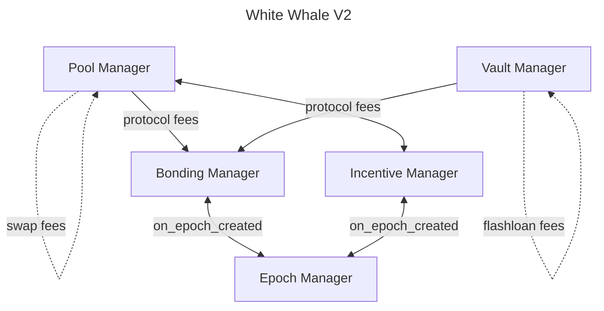

<a href="https://whitewhale.money/">
  <h1 align="center">
    <picture>
      
    </picture>
  </h1>
</a>

[![Discord badge][]][discord invite]
[![Twitter handle][]][twitter badge]

[discord invite]: https://discord.com/invite/tSxyyCWgYX
[discord badge]: https://img.shields.io/discord/908044702794801233
[twitter handle]: https://img.shields.io/twitter/follow/WhiteWhaleDefi.svg?style=social&label=Follow
[twitter badge]: https://twitter.com/intent/follow?screen_name=WhiteWhaleDefi

## Getting started

To get started with `white-whale-core`, please go through the [contributing guide](./docs/CONTRIBUTING.md) to see the
different ways to contribute to the project.

## Resources

1. [Website](https://whitewhale.money/)
2. [LitePaper](https://whitewhale.money/LitepaperV2.pdf)
3. [Docs](https://docs.whitewhale.money/white-whale)
4. [Discord](https://discord.com/invite/tSxyyCWgYX)
5. [Twitter](https://twitter.com/WhiteWhaleDefi)
6. [Telegram](https://t.me/whitewhaleofficial)

## V2 Architecture

White Whale V2 is the next iteration of the White Whale protocol V1. Besides minor yet impactful tweaks, functionality wise V2
hasn't changed much from V1. The main difference is the architecture, which makes it easier to integrate with to other
protocols. In V1, the protocol used multiple contracts which makes it complex, factories spawning other contracts and so on.
In V2, the protocol has been simplified significantly and built around singleton contracts. So to get an idea, V1 had 14+ contracts,
while V2 has only 5 contracts.

The following is the V2 architecture, and a general description of each contract:

The direction of the arrows represents the dependencies between the contracts.

### Pool Manager

The Pool Manager is the contract that manages the pools in the protocol. It is responsible for creating pool and handling
swaps. Pool creation is permisionless, meaning anyone can create a pool if the fee is paid. The Pool Manager depends on
both the Incentive and Bonding Managers.

### Vault Manager

The Vault Manager is the contract that manages the vaults in the protocol. It is responsible for creating vaults and performing
flashloan operations. Vault creation is permissionless, meaning anyone can create a vault if the fee is paid. The Vault Manager
depends on the Bonding Manager, as that's where the flashloan fees are sent for distribution.

### Incentive Manager

The Incentive Manager is the contract that manages the incentives in the protocol. It is responsible for creating and
distributing incentives on pools. Incentive creation is permissionless, meaning anyone can create an incentive if the fee is paid.
The Incentive Manager depends on the Epoch Manager, as incentives are distributed based on epochs.

### Bonding Manager
The Bonding Manager is the contract that manages the bonding in the protocol. It is responsible for bonding eligible tokens 
and distributing the fees generated by the pools and vaults among the users that bond tokens. The Bonding Manager depends 
on the Epoch Manager, as the rewards distribution is done based on epochs.

### Epoch Manager

The Epoch Manager is the contract that manages the epochs in the protocol. Its single responsibility is to create the epochs,
which are used by the Incentive and Bonding Managers for distributing incentives and fees.

---

## Deployed contracts

White Whale is a protocol that exists across multiple chains. You can find contract addresses for different chain deployments
in the [documentation](https://docs.whitewhale.money/white-whale/smart-contracts/liquidity-hub-deployments).

## Building and Deploying White Whale

To build and deploy White Whale's smart contracts, there are a series of deployment scripts under `scripts/`. Alternatively,
there are a few `just` recipes you can take advantage of. You need at least Rust v1.65.0 to compile the contracts.

### Build scripts

- `build_release.sh`: builds the project artifacts, optimized for production.
- `build_schemas.sh`: generates schemas for the contracts.
- `check_artifacts_size.sh`: validates the size of the optimized artifacts. The default maximum size is 600 kB, though
  it is customizable by passing the number of kB to the script. For example `check_artifacts_size.sh 400` verifies the
  artifacts are under 400 kB.

### Just recipes

All recipes are found in the `justfile`. To see all available recipes, run `just` or `just --list`. Here are some of them:

- `build FEATURE=''` # Builds the whole project with the a feature flag if provided.
- `fmt` # Formats the rust, toml and sh files in the project.
- `get-pools CHAIN` # Extracts the pools from the given chain.
- `schemas` # Generates the schemas for the contracts.

### Deployment scripts

TODO update deployment scripts for V2.

## Testing White Whale

To run the tests, run `cargo test`. You can also run `cargo tarpaulin -v` to get test code coverage. Note that the White Whale
project contains a few feature flags that can be used to run the tests. If you want to run the tests for a particular feature,
run `cargo test --features "feature_name"`.

## Disclaimer

**Use the contracts and the White Whale app at your own risk!**

## Audit

The White Whale V2 contract's audit is currently in progress.

## Contributing

[Contributing Guide](./docs/CONTRIBUTING.md)

[Code of Conduct](./docs/CODE_OF_CONDUCT.md)

[Security Policies and Procedures](./docs/SECURITY.md)

[License](./LICENSE)
