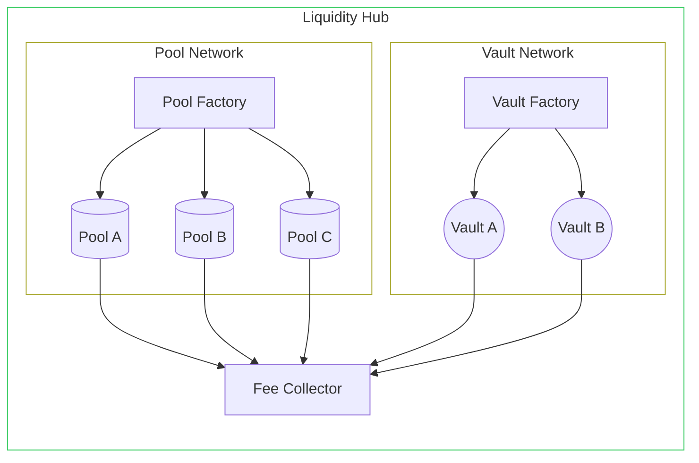

# Liquidity Hub

Liquidity Hubs (LH) are established on Cosmos blockchains selected by WW governance. The Liquidity Hubs are the point of
interaction for bots and depositors with the WW protocol and infrastructure. Arb bots request flash loans to arb price 
differences between WW LPs and Local Dex LPs. Depositors earn fees for their deposits into vaults used for flash loans or
into LPs accessible by bots. The LH components are described below.

### Pool network
The pool network is a WW-controlled collection of Automated Market Maker (AMM) pools of WW-selected tokens (WW pools) 
relevant to the chain of the pool network (e.g., Atom-Luna and Atom-Juno LPs on both Terra and Juno chains). The token price
exchange in each pool in the local pool network loosely represents the “interchain price” for the token because when the 
price changes of one pool on one network (e.g., Juno) then the Interchain Command will take action to balance the price of the
same pool on the other network(s) (e.g., Terra). 

These WW pools allow bots to arb the local dexes versus the “interchain price” that effectively decreases price disparities.

The Pool Network is comprised by the following components:

- Pool Factory: Manages the deployment and parameters of WW pools. Requires governance permission.
- Pool Router: allows bots and end-users to swap tokens in and out of pools on the liquidity hub for arbitrage purposes.
- WW Pool: pools holding token pairs.

### Vault Network
The Vault Network is a WW-controlled collection of single asset vaults that bots use to access flashloan capital for arbitrage, 
liquidation, and other DeFi uses. By using the Flash Loan Vaults, arbitrage and liquidations happen locally in a capital-efficient 
manner and without capital requirements.

The Vault Network is comprised by the following components:

- Vaults: store tokens needed to make flash loans (e.g. Atom, Luna, and Juno)
- Vault Factory: Manages the deployment and parameters of the vaults. Requires governance permission.
- Vault Router: Routes request to flash-loan assets to the specific vaults

### Fee collector
The local fee collector contract charges the fees for usage of the pool and vault network on a specific blockchain. 
Part of the collected fees goes back to the depositors of the WW pools and/or the single asset flash loan vaults. 
The remainder is sent to the interchain collector as protocol revenue. The protocol revenue is then distributed to WHALE 
stakers in the form of token buybacks.

### Graphic Overview

For more info about the Liquidity Hub, please refer to the [Litepaper](https://whitewhale.money/LitepaperV2.pdf).
