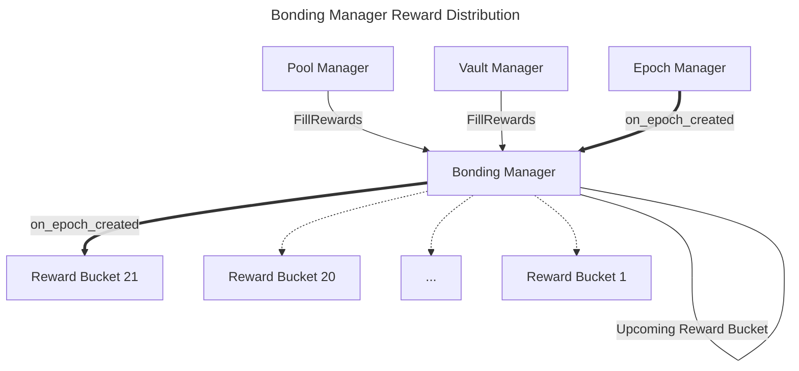

# Bonding Manager

The Bonding Manager is the evolution of the Whale Lair, fee distributor and fee collector. It is a bonding contract used
to bond WHALE LSDs, collect fees from pools/vaults and distribute them as rewards to bonders.

## How it works

The following is a high-level overview of how the Bonding Manager works. It touches on some technical details, assisting
developers in understanding the contract's inner workings, while also providing a general understanding of the contract's
functionality so a regular user can understand how to interact with it.

### Rewards

Users must bond WHALE LSDs to the Bonding Manager to start earning rewards generated by the system, i.e. pools and vaults. 
Every time there's a swap on the pool manager or a flashloan taken on the vault manager, a fee is collected and sent to 
the Bonding Manager via the `FillRewards` message. The rewards collected within an epoch are temporarily stored in the 
`UPCOMING_REWARD_BUCKET`, which is then distributed to bonders when the next epoch is created via the Epoch Manager 
contract, which has a hook to the Bonding Manager calling `EpochChangedHook`.

When `EpochChangedHook` is called, a new `RewardBucket` is created from the rewards collected in the previous epoch
(stored in `UPCOMING_REWARD_BUCKET`), with a snapshot of the global index stored in `GLOBAL`. The `GlobalIndex` struct
contains information about the total bonded WHALE LSDs, the epoch id it of the snapshot, when (epoch id) was it last updated,
and most importantly, the global weight. The weight is a formula based on how many assets are in the contract and a time factor,
that rewards users that have bonded the longer. The weight is used to calculate the rewards for each bonder when the
claim takes place.

### Bonding and Withdrawing

The bonding process is simple. Users call the `Bond` message passing the amount of WHALE LSD they want to bond. This is
stored as a `Bond` struct within the `BONDS` indexed map. The `Bond`struct contains information about the amount of LSDs
the user has bonded, the epoch at which it was created, when (epoch id) was it last updated, and the weight of the bond.

There's an unbonding period set up when the contract is instantiated. Whenever a user wants to withdraw their funds, it
needs to call the `Unbond` message specifying the amount of tokens it wants to unbond. This action will create a `Bond`
with an `unbonded_at` field, which is the timestamp when the user will be able to withdraw the funds. That value is calculated
based on the unbonding period. Once the `unbonded_at` timestamp is reached, the user can call the `Withdraw` to get the
funds back.

### Claiming

Rewards, stored in reward buckets, are only distributed to users that have bonded assets. Users can only claim rewards
from the next epoch after the one they have bonded (no retroactive rewards). The rewards are calculated based on the
user's weight and the global weight for a given epoch.

To claim, users need to call the `Claim` message, which will return all the rewards they are entitled to from the claimable
reward buckets. The rewards buckets expire after a number of epochs set up when the contract is instantiated. Once a reward
bucket expires, it gets forwarded to a newly created reward bucket when a new epoch is created, i.e. when `EpochChangedHook`
is called by the Epoch Manager.

Once a user claims, the epoch id at which the user claimed is stored in `LAST_CLAIMED_EPOCH`. This helps computing the
rewards buckets a user can claim from.
