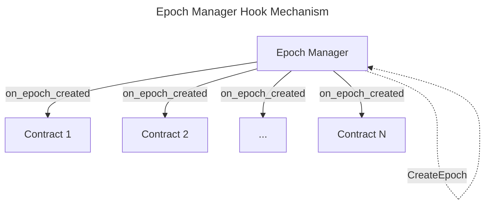

# Epoch Manager

The Epoch Manager is a contract which sole purpose is to create epochs on the Migaloo ecosystem, acting like a clock for 
the other contracts. 

An `Epoch` is a period of time that is defined by the `duration` parameter on `EpochConfig`, and they are used by other 
contracts to take timely actions. For example, the Bonding Manager uses epochs to calculate the rewards for the bonders,
while the Incentive Manager uses epochs to calculate the incentive rewards for its users.

## How it works

The epoch configuration is set up when the contract is instantiated. The epoch configuration defines 
the duration of an epoch and when the genesis epoch is gonna take place, i.e. the first epoch.

Once the genesis epoch is created, after the epoch duration has passed, anyone can create a new epoch by calling the 
`CreateEpoch` message. This action will create a new epoch by increasing the epoch id by one, adjust the start time for 
the new epoch and alert the contracts that have registered for the hook.

## Epoch Hook

There are two actions that only the owner of the Epoch Manager can execute: `AddHook` and `RemoveHook`. These add or 
remove a contract to the `HOOKS` list.

These contracts must implement the `EpochChangedHookMsg` interface, which is the signature of the message that will be 
executed on the hooks when a new epoch is created. The hook contains the current `Epoch`, specifying the id and start_time.

