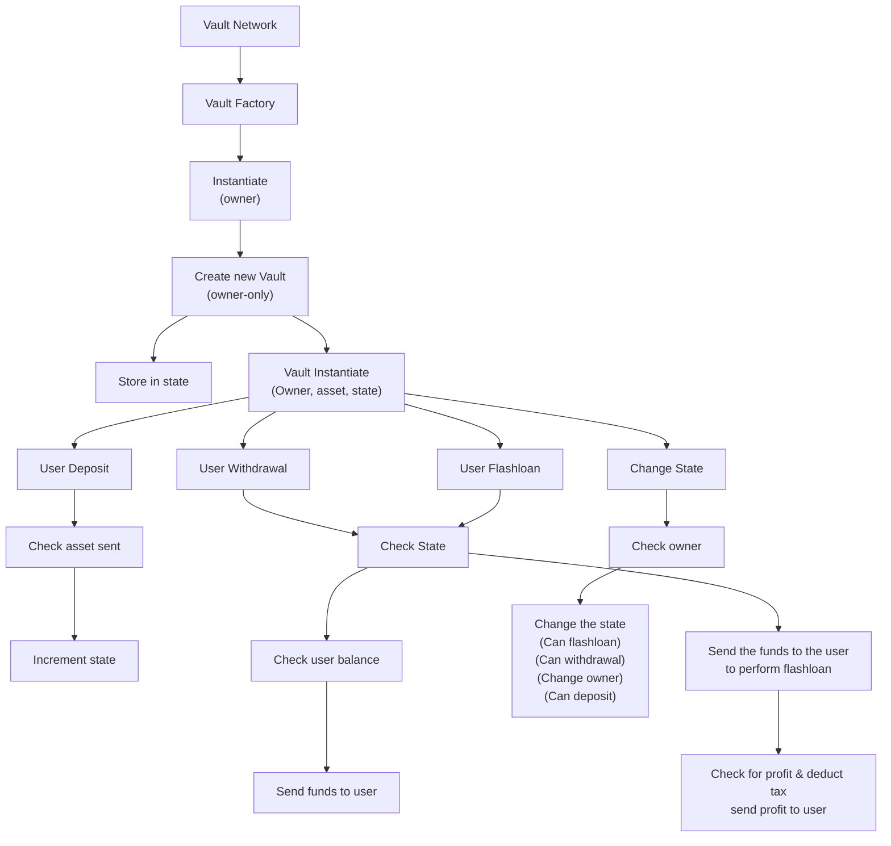

# Vault Network

Contracts for the vault network flow (factory, router and vault instances).

### Graphic Overview

```mermaid
graph TD
    VN[Vault Network] --> VF
    VF[Vault Factory] --> Instantiate["Instantiate <br>(owner)"]
    Instantiate --> NewVault["Create new Vault <br>(owner-only)"] --> StoreState["Store in state"]
    NewVault --> V

    V["Vault Instantiate<br>(Owner, asset, state)"]

    V --> UserDeposit[User Deposit]
    V --> UserWithdrawal[User Withdrawal]
    V--> ChangeState[Change State]
    V --> UserFlashloan[User Flashloan]

    UserDeposit --> CheckAsset["Check asset sent"] --> IncrementState["Increment state"]
    UserWithdrawal --> CheckState["Check State"] --> BalanceCheck["Check user balance"] --> SendFund["Send funds to user"]
    ChangeState --> CheckOwner[Check owner] --> PerformChangeState["Change the state<br>(Can flashloan)<br>(Can withdrawal)<br>(Change owner)<br>(Can deposit)"]
    UserFlashloan --> CheckState --> SendFunds[Send the funds to the user<br>to perform flashloan] --> CheckProfit[Check for profit & deduct tax<br>send profit to user]
```
